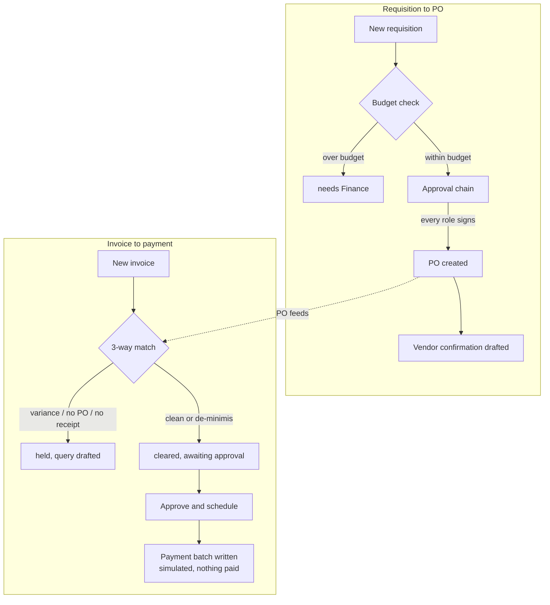

# Procure-to-Pay AI - "The Paymaster"

Automates the full procure-to-pay cycle: purchase requisitions with budget checks, approval routing per your delegation-of-authority matrix, PO creation and vendor confirmation, goods-receipt matching, 3-way invoice match with reason-coded mismatch flags, and payment-batch preparation - with a complete audit trail at every step.

## What it does

Automates the full procure-to-pay cycle: purchase requisitions with budget
checks, approval routing per your delegation-of-authority matrix, PO
creation and vendor confirmation, goods-receipt matching, 3-way invoice
match with reason-coded mismatch flags, and payment-batch preparation - with
a complete audit trail at every step.

## What it won't do

Never releases money: payment authorisation stays with your signatories
(dual approval at the bank remains human). Mismatched invoices go to a
query workflow, not through.

## Why it matters

P2P is where hotel groups leak money and time - manual hand-offs, chased
approvals, unmatched invoices. This enforces the controls you already wrote
down.

## What to expect

Invoice-to-payment cycle from days to hours; every 3-way mismatch caught and
reason-coded automatically.

**ROI:** -75% invoice-to-payment cycle (labor).

## Who it's for

A hotel or a small group with a real delegation-of-authority matrix and at
least one budget line worth tracking - a controller, an accounts-payable
person, or a general manager who currently does the PO-to-invoice
arithmetic by hand. Works for hotel and restaurant properties.

- **A single hotel** with one budget owner and a short approval chain:
  requisition to PO to matched invoice, with the payment batch prepared for
  whoever signs the bank transfer.
- **A small group** with a real delegation-of-authority matrix (department
  head, then GM, then owner above a threshold) and more than a handful of
  purchase orders a month.
- **A restaurant or F&B-heavy property**, where short deliveries and item
  substitutions are the norm rather than the exception. This repo ships the
  hotel-general version - amount-only matching, no quantity dimension - see
  `docs/benefits.md` for the honest caveat and what a restaurant deployment
  would need on top.

**Not a fit** for a property with no formal PO process at all - this agent's
whole value is enforcing controls that already exist on paper. If nobody
signs off on spend today, start there first.

## How it works



**Two modes.**

| Mode | What happens |
|---|---|
| `shadow` (default) | Reads, decides, drafts, queues. Never sends an email, never writes a payment-batch line. |
| `live` | An approved item really sends or really writes its batch line. Everything else still waits. |

**The review loop.** Every drafted email (a vendor query, a vendor
confirmation, an approval chase, a letter of award) and every cleared
invoice waits in one queue (`make review`) until a human approves, edits or
rejects it. A payment-batch line is never automatic, in any mode - see
`docs/safety.md`.

**What runs when.**

| Workflow | Command | Cadence | Calls a model? |
|---|---|---|---|
| Requisition, receipt and invoice intake | `tools/run.py --once` | every 15 min | only on a held invoice (vendor query) |
| Approval chase | `tools/chase.py` | morning, daily | only when something is overdue |
| Tender & CAPEX (if enabled) | `tools/capex.py` | on demand | only on draft-recommendation / award |
| Review queue | `tools/review.py` | as needed | never |

`python3 tools/schedule.py --all` prints a ready-to-install snippet for
every scheduled row above - see section 9.

**Sub-agent included, off by default:** Tender & CAPEX Approval AI ("The
Chancellor") - see section 12.

**A worked example.** The set piece this agent is built to catch: an
invoice for EUR 1,719.00 arrives against a purchase order raised at
EUR 1,572.50. That is EUR 146.50 over, +9.3% - both above the 2% and the
EUR 100 tolerance, so the payment stops. The agent writes the reason as a
sentence a controller could paste into an email:

> Price variance: invoiced EUR 1,719.00 against PO-00102 at EUR 1,572.50 -
> +9.3% (+EUR 146.50) on 'Weekly seafood delivery'. Above the 2.0% /
> EUR 100.00 tolerance - 2% and EUR 100.00, whichever bites second - so the
> payment stops here.

Turn `three-way` off in `config/agent.yaml: rules` and the same invoice
clears on the vendor's word alone - a deliberate, provable demonstration of
what the control is actually doing. Every amount in this repo, including
that reason string, is formatted with `hotel.currency` from
`config/hotel.yaml` - never a hardcoded EUR, so a property billing in GBP or
NOK sees its own currency everywhere.

## What you need

| You need | Why | Time |
|---|---|---|
| A delegation-of-authority matrix | routes requisition approvals | 15 min to write down |
| At least one budget line | requisitions check against it | 5 min |
| An accounts-payable mailbox (IMAP or Gmail) | vendor queries, confirmations, chases | 10 min |
| A purchase-order / invoice export, or none yet | matching runs on structured records, CSV or the bundled sample data | 0-20 min |
| Claude Code subscription or an Anthropic API key | drafts the four emails this agent sends | 5-20 min |

See "Set up with Claude Code" below for how the Claude Code subscription or
API key gets connected.

## Quick start (5 minutes, no credentials)

```bash
git clone https://github.com/th1-ai/procure-to-pay-ai.git procure-to-pay-ai
cd procure-to-pay-ai
make setup
make demo
```

You should see requisitions routed for approval, purchase orders matched
against sample invoices, and the review queue explained, ending with:

```
Payment batch preview: 3 invoice(s) cleared for payment (EUR 1,541.20); 4 on hold (EUR 2,739.00), 1 of them a price variance.
Nothing was sent or scheduled: mode is shadow, and demo never approves or sends.
Next: `make review` to see the drafts, or read workflows/10-procure-to-pay.md.

DEMO OK - 10 items processed, 4 drafted, 0 sent (shadow)
```

If you see that, everything is wired up. If not, `workflows/99-troubleshooting.md`
covers the common causes.

## Set up with Claude Code

Open `claude` in this folder. Paste each prompt below in order - each phase
names the workflow file Claude will follow.

**Phase 1 - get it running.**
> Read `workflows/00-setup.md` and walk me through first-run setup: install,
> run the demo, and help me fill in `config/hotel.yaml`, `config/agent.yaml`
> (budgets, delegation matrix, approved vendors) and `knowledge/property.md`.

**Phase 2 - run it for real.**
> Read `workflows/10-procure-to-pay.md`. Run one pass, show me what is
> waiting for approval and what is on hold, and explain each hold in plain
> language.

**Phase 3 - work the queue.**
> Read `workflows/80-review.md`. Walk me through approving the cleared
> invoices and deciding on the held ones.

**Phase 4 (optional) - Tender & CAPEX.**
> Read `workflows/20-tender-capex.md`. Turn on the Tender & CAPEX sub-agent
> and walk me through the two sample projects.

**Phase 5 - go live, when ready.**
> Read `workflows/90-go-live.md`. Check the checklist against where we
> actually are, and only change `mode` to `live` if every item is genuinely
> true.

## Connect your systems

`make doctor` shows the live status of every adapter. This agent uses only
**email** and **sheets**, plus three small readers of its own - it does not
use a PMS or WhatsApp/chat messaging, ignore those two lines in the doctor
table.

| System | Adapter | Status | Needs |
|---|---|---|---|
| Accounts-payable mailbox | `imap` | universal | mailbox + app password |
| Accounts-payable mailbox | `gmail` | built | Google OAuth desktop client |
| Payment batch / report export | `csv` | universal | nothing |
| Payment batch / report export | `google` | built | service account JSON |
| Purchase orders / invoices / requisitions / receipts | `mock` | universal | nothing (sample data) |
| Purchase orders / invoices / requisitions / receipts | `csv` | universal | a spreadsheet export |
| Everything else (`pos`, `accounting`, `reviews`, `calendar`, `payments`, `procurement`, `locks`) | - | stub | see `docs/integrations.md` |

Full detail, including exact `.env` variables and CSV column names:
`docs/integrations.md`.

**The `payments` stub is never going to be more than a stub in this repo.**
That is a deliberate choice, not a gap - see "Guardrails & safety" below.

## Run it

```bash
make run                        # one pass: receipts, requisitions, invoices
make run ARGS="--limit 5"       # just the first five records per phase
make run ARGS="--dry-run"       # compute everything, write nothing
make watch                      # loop on the configured interval
python3 tools/requisition.py list
python3 tools/requisition.py approve <id> --role "Department Head"
python3 tools/receiving.py record <PO-ref>
python3 tools/payment_batch.py preview
python3 tools/chase.py
make review
make report
```

**Scheduling.** `python3 tools/schedule.py --all` prints a ready-to-install
snippet (cron, launchd, or systemd) for every job in `config/agent.yaml:
schedule` - the main loop every 15 minutes, the approval chase every
morning. Examples for a Mac, a Linux box, or a VPS are in `scheduler/`.

**Subscription or API.** `llm.provider: interactive` or `claude-code` uses
the Claude Code subscription you are already paying for - the right choice
while you are learning what the agent does, or for a single property.
`llm.provider: anthropic` with your own `ANTHROPIC_API_KEY` is the right
choice for volume across several properties; automated use of a personal
subscription is subject to Anthropic's usage policy and rate limits. See
`docs/safety.md`.

## Go live

Shadow is the default and the safe place to learn what this agent does.
Going live is the hotel's decision - the full checklist is
`workflows/90-go-live.md`; the short version:

- [ ] `make doctor` is clean.
- [ ] Real budgets, a real delegation matrix, and real vendor/approver
      email addresses are in `config/agent.yaml` - not the shipped
      placeholders.
- [ ] A few real requisitions and invoices have gone through the review
      queue.
- [ ] `python3 tools/review.py stale` has cleared the shadow-era queue.

```yaml
# config/hotel.yaml
mode: live
```

`review.require_approval_for` still lists `payment` and `send_email` -
**never remove `payment`.** Even if you did, a payment-batch write would
stay blocked without an approval: `payment` is enforced in code, not
config (`core.review.ALWAYS_HUMAN_ACTIONS`), in every mode. Going live
means an approved item can now really send or really write its batch line,
not that anything skips approval.
Flip `mode` back to `shadow` (or set `AGENT_MODE=shadow` in `.env`) to stop
everything immediately, at any time.

## Guardrails & safety

Full detail in `docs/safety.md`. The essentials:

- **Never releases money, in any mode.** Payment authorisation stays with
  your signatories. A payment-batch line is a record for your own banking
  process - `data/exports/payment-batches/`, labelled "SIMULATED: nothing
  was actually paid" - never a call that moves money. This is **enforced in
  code, not config**: `core.review.ALWAYS_HUMAN_ACTIONS` hardcodes
  `"payment"` as needing an approved item in every mode, so removing
  `payment` from `review.require_approval_for` in `config/hotel.yaml`
  cannot let an unapproved payment-batch write go through.
- **`mode: shadow` blocks every send and every payment-batch write**,
  approved or not. `--dry-run` computes and writes no business data, even in
  live mode - it does record one `runs` row flagged `"dry_run": true`, so a
  rehearsal shows up in the audit trail without touching `items`,
  `p2p_requisitions`, `p2p_pos` or `p2p_capex`.
- **No goods receipt, no payment**, unconditionally - not tolerance-gated.
- **No PO record on the invoice means a hold**, not a guess - an invoice
  quoting a PO that does not exist is treated as more suspicious than one
  with no PO at all.
- **A budget-hold requisition has no "approve anyway."** It needs a config
  change or a documented Finance exception.
- **AI disclosure.** Every drafted email carries your email signature (set
  up in `workflows/00-setup.md`, kept in `knowledge/`), which should say
  plainly that it was prepared with AI assistance and reviewed by a person -
  see `docs/safety.md` for suggested wording and the EU AI Act Article 50
  context.
- **Data handling and GDPR** - what leaves the machine, what is stored,
  right-to-erasure: `docs/safety.md`.

## Sub-agents in this repo

### Tender & CAPEX Approval AI - "The Chancellor"

Off by default (`config/agent.yaml: subagents.tender_capex.enabled`). The
parent works fully without it.

**Does.** Runs the tender and CAPEX lifecycle for groups: budget requests,
RFP assembly, vendor qualification and bid collection, evaluation scoring
sheets, negotiation scheduling, and letter-of-award drafting - routing each
approval to the right level and keeping a complete, auditable record.

**Won't.** Never picks the winner: evaluation and award decisions stay with
your committee. It prepares, routes, and documents.

**Why.** Tenders and CAPEX approvals crawl through inboxes for months. This
keeps every step moving, compliant, and on the record.

**Output.** Tender cycles compressed and fully documented; no approval sits
unactioned.

Turned on, it scores every quote on a tender deterministically (budget fit,
warranty, whether the work phases around trading, a scope gap that
disqualifies rather than merely penalises), refuses to recommend below three
comparable quotes unless you turn that rule off, routes the recommendation
to a three-role approval chain, and drafts the letter of award once every
role has signed. Full detail: `docs/sub-agents.md` and
`workflows/20-tender-capex.md`.

**"Never picks the winner" is the sharpest line in this sub-agent's
promise, and the copy is written to earn it.** The comparison table always
prints, whatever the outcome; the top-ranked quote is labelled "for
committee consideration," never "Recommended"; and the approval chain stays
locked until a recommendation exists at all - nobody signs off on a quote
comparison that has not been made. Three roles still have to sign
individually before anything is released to a vendor.

## Customising

- **`knowledge/`** - property facts, an optional FAQ, the email signature
  (with your AI-disclosure line), and a plain-language mirror of your
  procurement policy. Copy the example files in that folder and edit.
- **`prompts/`** - the four drafting tasks (`prompts/vendor-query.md`,
  `prompts/vendor-confirmation.md`, `prompts/approval-chase.md`,
  `prompts/award-letter.md`) are
  plain markdown with a JSON schema next to each in `prompts/schemas/`. Edit
  the tone, keep the schema.
- **`config/agent.yaml`** - `budgets`, `delegation_matrix`, `matching`
  tolerances, `approved_vendors`, `vendor_emails`, `approver_emails`,
  `chase` cadence, and the Tender & CAPEX sub-agent's own block. Every knob
  is commented in the file.
- **A language other than English.** Set `hotel.languages` in
  `config/hotel.yaml` (first entry is the default) - every one of the four
  drafting prompts already tells the model to "write it in
  `{{default_language}}`", so a draft comes back in your property's own
  working language without editing the prompt files. `make doctor` warns if
  a prompt is ever edited to drop that instruction. Every draft is also
  checked after the fact with `core.i18n.detect_language`: if the model
  writes in a language not in `hotel.languages` anyway, the item goes to
  `needs_human` instead of clearing straight to the review queue - see
  `docs/how-it-works.md`, "Language rule". Edit `knowledge/property.md` and
  the `prompts/*.md` text itself only if you want the tone or the ground
  rules to read in your own language too - the schema stays JSON either way.

## Troubleshooting & FAQ

Full list: `workflows/99-troubleshooting.md`. The most common:

**"make demo doesn't print DEMO OK."** Run `make setup` first, and check
`fixtures/hotel/purchase-orders.json` and `fixtures/inbound/` are intact.

**"make run exits with code 3."** Not an error - `llm.provider: interactive`
parked a prompt in `data/pending/`. Answer it and re-run.

**"A send says no email address on file."** `config/agent.yaml:
vendor_emails` / `approver_emails` ship blank. Fill in the real address,
then `python3 tools/review.py retry <id>`.

**"Can this read our real ERP?"** Not out of the box - it reads a CSV
export (`docs/integrations.md`), which works with anything that can export
one. A hotel's Claude session can build a direct API reader from there; see
the recipe in `docs/integrations.md`.

**"Does this replace our accounting system?"** No. It decides whether an
invoice is clear to pay and prepares the batch a person executes in your
own banking and accounting systems - it does not post a ledger entry or
hold your books of record.

## Measuring the benefit

```bash
python3 tools/report.py
```

Prints, from your own data:

- **Cleared rate** - the share of invoices whose match came back clean or
  inside the de-minimis floor, against the roster's "every 3-way mismatch
  caught."
- **Held value and variance count** - euros waiting on a query, and how
  many are a genuine price variance.
- **Average requisition to PO** - the practical measure of "invoice-to-payment
  cycle from days to hours," on the upstream half of the chain.
- **LLM spend** - the four drafting prompts are the only model calls this
  repo makes.

See `docs/benefits.md` for what these numbers mean and the honest caveats on
the roster's ROI estimate.

## About

Built by [TH1](https://th1.ai) - AI agents for hotels, deployed on your own
Claude Code subscription or API key, never on TH1's infrastructure.

Licensed under the MIT License - see `LICENSE`. This repo is a template: fork
it, run it, change anything in it.

**Want it run for you, or built out further** (a real ERP integration, the
award-to-PO bridge, a duplicate-invoice check)? Talk to TH1: [th1.ai](https://th1.ai).

**Changelog:** first published version.
