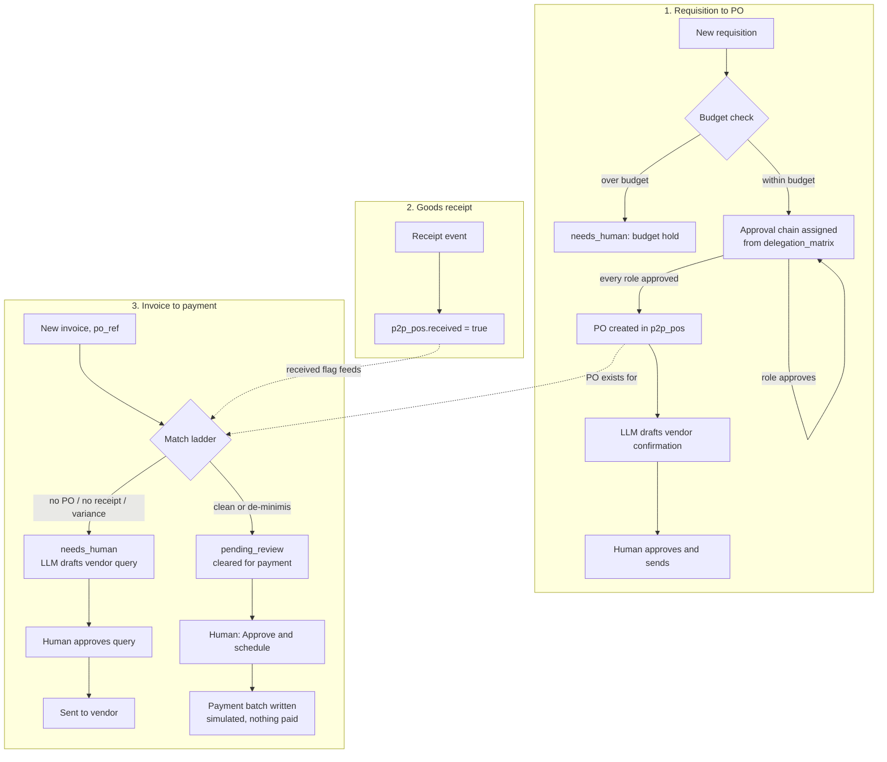

# How Procure-to-Pay AI works

Procure-to-Pay AI ("The Paymaster") runs the middle of the procure-to-pay chain:
**requisition → budget check → approval → purchase order → vendor confirmation →
goods receipt → 3-way invoice match → payment-batch preparation.** A person still
signs every payment. See "Where this agent starts and stops" below for exactly
what the two neighbouring agents in this family own instead.

Deterministic decisioning, LLM for language: every gate (budget check, approval
routing, the match ladder, the three-quotes rule) is plain Python you can read
in `tools/*_engine.py` and unit-test without a model. The only four LLM calls
in the repo draft prose a human will read and send: a vendor query on a held
invoice, a vendor confirmation once a PO is created, a chase email to an
overdue approver, and (Tender & CAPEX sub-agent only) a letter of award.

## The three chains



`tools/run.py --once` runs three fetch phases in order every pass: goods
receipts, new requisitions, new invoices. Each phase fetches, dedups against
`core.store.already_processed`, decides deterministically, drafts with an LLM
only where the spec calls for prose, and queues. `tools/requisition.py` and
`tools/receiving.py` are separate, deliberately human-triggered tools for the
two steps that are not "new record arrived" events: approving a role on the
chain, and recording a receipt.

## What runs when

| Workflow | Tool | Cadence | Provider calls |
|---|---|---|---|
| Requisition, receipt and invoice intake | `tools/run.py --once` | every 15 min (config `schedule.procure-to-pay`) | `vendor-query`, `vendor-confirmation` (only when triggered) |
| Approval chase | `tools/chase.py` | morning, daily | `approval-chase` |
| Tender & CAPEX (if enabled) | `tools/capex.py draft-recommendation` | on demand, human-triggered | `award-letter` (on full approval) |
| Review queue | `tools/review.py` | whenever a human works it | none |
| Payment batch preview | `tools/payment_batch.py preview` | before every "Approve and schedule" | none |
| Report | `tools/report.py` | weekly | none |

`python3 tools/schedule.py --all` prints one snippet per row above except the
human-triggered ones. See README section 9.

## Where this agent starts and stops

Three agents in this family touch the same paperwork. Installing more than one
is normal; each owns a different slice, and none re-does another's work.

- **Finance Filing AI ("The Bookkeeper")** captures invoice emails and PDFs,
  extracts the structured fields with an LLM, picks a ledger (GL) category,
  and files the record. It reads a purchase-order ledger to decide whether an
  invoice can file itself, but it has no requisitions, no approval chain, no
  PO creation, and no payment-batch concept — its output is a filed accounting
  record, not a payment decision.
- **Procurement / Supply AI ("The Quartermaster")** forecasts consumption and
  drafts routine supplier orders from stock levels. It does not raise a formal
  purchase order with a budget line and an approval chain, and it never sees
  an invoice.
- **This agent (Procure-to-Pay AI, "The Paymaster")** owns the purchase order's
  whole life — requisition, budget check, approval, PO, vendor confirmation,
  goods receipt — and the payment-authorisation half of the invoice: the
  3-way match, the reason-coded variance, and the payment-batch line. It does
  **not** do OCR/PDF extraction or ledger coding.

**Invoice input is already structured.** This agent reads `vendor, invoice_no,
amount, currency, po_ref, description` — either exported from Finance Filing
AI's finances sheet, from your ERP/AP system, or a plain CSV/JSON import (see
`docs/integrations.md`). It never reads a raw email or PDF. That keeps
extraction logic in exactly one place in this family and means the two agents
can run side by side without double-processing the same document, or you can
run this one alone against a CSV export from whatever system you already use
for invoice capture.

**If you run this agent alongside Finance Filing AI**, point Finance Filing
AI's invoices that carry a `po_ref` at this agent's payment gate rather than
letting it auto-file them: give this agent its own copy of the invoice feed
(a second IMAP folder rule, or export the finances sheet into
`data/imports/invoices.csv`) so a PO-backed invoice always clears the 3-way
match here before it is treated as payable, on top of whatever Finance Filing
AI already recorded for the books.

## Data model

Three tables of its own, created with `store.migrate()` right after
`Store(settings)` — see `tools/store_ext.py`.

```sql
p2p_requisitions (id, title, department, requested_by, amount_eur, budget_line,
                   budget_check_json, approvals_json, stage, po_ref,
                   created_at, updated_at)
-- stage: new | budget_hold | awaiting_approval | approved | po_created | rejected

p2p_pos (po_ref PK, requisition_id, vendor, amount_eur, description,
         vendor_confirmed, received, received_at, source, created_at, updated_at)
-- source: "requisition" (built by this agent) | "seed" (pre-existing, from
-- fixtures/hotel/purchase-orders.json — represents POs raised before this
-- agent was installed, so invoice matching has something to match against
-- from day one)

p2p_capex (id, title, category, budget_eur, quotes_json, approvals_json, stage,
           recommendation, created_at, updated_at)
-- Tender & CAPEX sub-agent only
```

Invoices, vendor queries, vendor confirmations, approval chases and award
letters are all `core.store` `items` rows (the generic review queue) —
they need exactly one human decision each (approve / edit / reject), which is
what the core FSM is built for. Requisitions and CAPEX projects need a
**sequence** of named-role decisions instead, so they get their own tables and
their own small CLIs (`tools/requisition.py`, `tools/capex.py`), the same way
the Tender & CAPEX approval chain works in the source spec.

## Idempotency

- Invoices, vendor queries, confirmations and chases: `(source, external_id)`
  unique in `items` via `store.upsert_item` — a re-fetched fixture or CSV row
  is never processed twice.
- Requisitions: `p2p_requisitions.id` is the fixture/import id, checked before
  insert.
- Purchase orders: `po_ref` is the primary key. `store.next_sequence("po")`
  hands out the next `PO-xxxxx` number, transactionally, and is never
  incremented on a dry run — see `core.store.next_sequence` docstring.
- Goods receipts: `mark_received` is a plain `UPDATE ... WHERE po_ref=?`; a
  duplicate receipt event for an already-received PO is a no-op, logged, not
  an error.
- Payment-batch lines: an invoice item can only reach `sending` from
  `approved`/`edited` once (the core FSM's atomic claim in
  `store.claim_for_send`), so the same invoice can never be scheduled twice.

## Resumable stages

An invoice on the `hold` path caches its match decision on the item before
attempting the `vendor-query` LLM draft (`_match_cache` payload key). If the
`interactive` provider pends on the vendor-query prompt, a retry re-reads the
cached match instead of re-running the deterministic ladder, and resumes at
the draft stage rather than skipping the item — see the "trap found in
front-desk-ai" note in `factory/workflows/build-repo.md` section 1b, which
this repo follows exactly: cache stage results in `_`-prefixed payload keys,
and only move an item out of `new` once every stage for that pass is settled.

The same marker-after-pend idea applies to a CAPEX award-letter draft after
the last approval role signs (`tools/capex.py:cmd_approve()` caches
`{role, new_approvals}` in the award-letter item's `_capex_approval_cache`
payload key, keyed by the project's own stable id) and to the requisition
approval chain's last role, which creates the PO and drafts the vendor
confirmation (`tools/requisition.py:cmd_approve()`). The requisition case
cannot use an item-payload cache the same way: the vendor-confirmation
item's key IS the freshly-minted `po_ref`, which does not exist yet the
first time through, and re-drawing a `po_ref` on retry would both burn a
second PO number and change the draft's `fixture_id` — so the `interactive`
provider would build a different prompt id and never find the answer
already written for the first one. Instead `cmd_approve()` caches
`{role, new_approvals, po_ref}` in `core.store`'s `kv` table (the same table
that holds poll cursors), keyed by requisition id, and only commits
`p2p_requisitions.approvals` / `po_ref` / `stage` once the vendor
confirmation is actually drafted. Either way, the requisition's or the
CAPEX project's own authoritative record is not written until the draft
that follows it has actually succeeded, so a parked prompt leaves the role
honestly "pending", not a phantom "approved" with nothing drafted to show
for it.

## Design decisions (spec was silent or the demo had no code path)

The behavioural spec (`specs/procure-to-pay-ai.md` section 11 in the factory
this repo was built from) flags that most of the roster promise had no code
in the source demo — only the 3-way match, variance reason-coding and
payment-batch preparation were built. This repo builds real, testable code
for the rest too, and these are the choices made where the spec did not
prescribe one:

1. **Delegation-of-authority matrix is amount-banded, ascending, first match
   wins** (`config/agent.yaml: delegation_matrix`). A higher band's role list
   is assumed to include every role below it — write the full chain per band,
   do not assume it is additive in code.
2. **Budget "committed" is computed, not stored.** `budget_committed()` sums
   `p2p_requisitions.amount_eur` for every row in `awaiting_approval`,
   `approved` or `po_created` against a budget line. No separate mutable
   counter to drift out of sync with the requisitions table itself.
3. **Approval roles sign in any order once the chain is assigned** (matches
   the source Chancellor behaviour, and the spec's own open question 10 flags
   the same looseness there) — nothing here enforces Chief Engineer before
   GM before Owner. A future version could add `sequential: true` per band.
4. **Goods-receipt confirmation is an unguarded internal write**
   (`store_ext.mark_received`), not gated by `mode: shadow`. It records a fact
   reported by another internal system (the warehouse, or a person), the same
   way `procurement-supply-ai`'s `apply_delivery` does — nothing leaves the
   building. Everything downstream of it (the match verdict, the vendor query,
   the payment batch) still goes through the guard.
5. **The payment-batch write is a guarded local write** (`action="payment"`,
   already in `review.require_approval_for`'s default list), not a call
   through the `Payments` stub adapter. `Payments` in `core/adapters/base.py`
   is deliberately read-mostly (`list_charges`, `refund`) — there is no
   "release a payment" method to call, on purpose, because nothing here ever
   should. `tools/payments.py:schedule_payment` writes
   `data/exports/payment-batches/<date>.json` plus a sheets row, exactly like
   Finance Filing AI's `finalize_invoice` writes a filed record — a local
   artefact a human's own banking process reads, never a network call.
6. **Payment scheduling never auto-fires, even in `mode: live`.** Every other
   guarded write in this family can, in principle, run unattended once live
   and off the approval list. Payment is not on that list by design: the
   roster's "cant" is absolute ("payment authorisation stays with your
   signatories"), so `review.require_approval_for` always includes `payment`
   in the shipped example, and the go-live checklist (`workflows/90-go-live.md`)
   says not to remove it. That config list is a second line of defence, not
   the mechanism itself: the guarantee is **enforced in code, not config** -
   `core.review.ALWAYS_HUMAN_ACTIONS` hardcodes `payment` as needing an
   approved item in every mode, regardless of what
   `review.require_approval_for` says, so `tools/payments.py`'s
   `assert_write_allowed(settings, "payment", item)` call stays gated even if
   a hotel's config edit drops `payment` from that list.
7. **The "sent" status means "the payment-batch line was scheduled",
   never "money moved".** Same reuse of the generic state name Finance Filing
   AI makes for `auto_sent` meaning "filed". `docs/safety.md` and every place
   the status is printed say so explicitly.
8. **A scope-gap quote is disqualified, not merely penalised** (CAPEX
   scoring, `score = -999`), matching the source engine exactly. See
   `docs/sub-agents.md`.
9. **"Recommended" is relabelled "for committee consideration."** The source
   spec calls out its own tension between "never picks the winner" and a UI
   pill reading "Recommended" — this repo's CLI output uses the softer label
   throughout, per the spec's own suggestion (section 6).
10. **Award-letter drafting is real, not a stub.** The spec's open question 1
    names "letter-of-award drafting" as promised but never built. It is one
    LLM call over a fully-decided recommendation (`prompts/award-letter.md`),
    fired only once every approval role has signed.
11. **No utility cross-check, no GL coding, no PDF/email extraction here.**
    Those three belong entirely to Finance Filing AI (see "Where this agent
    starts and stops" above) — duplicating them would mean two agents
    disagreeing about the same invoice.
12. **Language rule.** This agent has no per-vendor language signal to read
    (unlike a guest-facing agent with a PMS preference field), so every one
    of the four `prompts/*.md` files tells the model, in its own ground
    rules, to "write it in `{{default_language}}`" — `hotel.languages`'s
    first entry, rendered by `core.templates.build_prompt`'s `_vars()`.
    `tools/drafting.py:check_language()` then checks what actually came
    back with `core.i18n.detect_language` — the same detector a
    guest-facing repo uses to pick a reply language. A confidently-detected
    language outside `hotel.languages` sends the item to `needs_human`
    (with the reason recorded on the event) instead of clearing straight to
    `pending_review`; a low-confidence guess is never flagged, so a short or
    ambiguous line is not held for nothing. `make doctor`'s "prompt
    languages" check warns if a `prompts/*.md` file is ever edited to drop
    the `{{default_language}}` / `{{hotel_languages}}` instruction
    (`tools/doctor.py:check_prompt_languages`). See SIMULATION.md Finding 3
    (2026-08-27), fixed in `factory/reports/procure-to-pay-ai-fix1.md`.

## Core requests

- No adapter for a purchase-order/procurement API exists yet
  (`core.adapters.get_stub("procurement", settings)` is a pure interface). This
  repo ships `tools/po_reader.py` (mock/csv) the same way `finance-filing-ai`
  ships `tools/po_ledger.py`, for the same reason — see that repo's own build
  report.
- A generic "local guarded write" helper (what `finalize_invoice` in
  Finance Filing AI and `schedule_payment` here both hand-roll) would save
  every agent that produces a filed artefact instead of an adapter call from
  repeating the same four lines. Worth adding to `core/review.py` as
  `write_local_artifact(settings, action, path, content, item=None)`.
